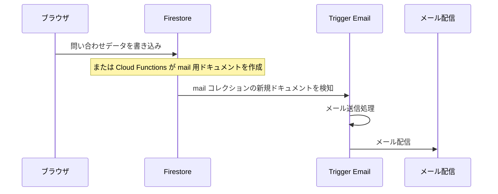

# お問い合わせメール送信（Trigger Email）

お問い合わせフォームからのメール送信を、Firebase 拡張機能 **Trigger Email** で実装するための設計・手順メモです。

現状（2026-06 更新）:

- フォーム UI・クライアント側バリデーションは実装済み（`src/contact.njk`, `js/contact-firebase.js`）
- Callable Function `submitContact` 実装済み（`functions/index.js`）
  - 社内通知: `mail/{submissionId}-notify` → `CONTACT_NOTIFY_EMAIL`
  - **自動返信**: `mail/{submissionId}-autoreply` → フォーム入力者のメール（同一アドレスは5分に1回まで）
- **Trigger Email 拡張の Console 設定・Functions デプロイ・通知先メール設定**が必要（下記「テスト用セットアップ」参照）

先方確認待ちの項目（本番 SMTP 先・届け先・自動返信・保持期間など）が固まったら、テスト用設定から本番値へ差し替える。

---

## テスト用セットアップ（自分のメールアドレス）

コード側は **案 B（Callable Function）** で実装済み。メールが実際に届くまでに Console / デプロイ作業が必要です。

### 1. Trigger Email をインストール（Firebase Console）

1. [Firebase Console](https://console.firebase.google.com/) → プロジェクト `omorifudosan`
2. **Extensions** → **Trigger Email**（`firestore-send-email`）をインストール
3. 監視コレクション: **`mail`**（既定）
4. **SMTP 設定**: テストなら自分の **Gmail** で OK
   - Authentication Type: **OAuth2** または **Username & Password**
   - Gmail の場合: [アプリパスワード](https://myaccount.google.com/apppasswords) または OAuth2（拡張 README 参照）
   - SMTP User: 自分の Gmail アドレス
5. インストール後、Console から `mail` にテストドキュメントを手動追加し、自分のメールに届くか確認

### 2. 通知先メールアドレスを設定

`functions/.env.example` をコピーして `functions/.env` を作成:

```bash
cp functions/.env.example functions/.env
# CONTACT_NOTIFY_EMAIL=あなたの@gmail.com に編集
```

### 3. デプロイ

```bash
cd functions && npm install && cd ..
firebase deploy --only functions,firestore:rules
npm run build
firebase deploy --only hosting
```

### 4. 動作確認

1. 本番 or ローカル（`npm run dev`）で `/contact` を開く
2. STEP 01 で相談種別を選択 → フォーム入力 → 送信
3. Firestore の `inquiries` と `mail` にドキュメントができる
4. 数秒〜1分以内に `CONTACT_NOTIFY_EMAIL` のアドレスに通知が届く

### トラブル時

| 症状 | 確認箇所 |
|------|----------|
| フォーム送信エラー | Functions ログ（Console → Functions → submitContact） |
| `mail` はあるがメールが来ない | Extensions → Trigger Email のログ / 迷惑メール |
| 「通知先メールアドレスが設定されていません」 | `functions/.env` の `CONTACT_NOTIFY_EMAIL` と再デプロイ |

本番切り替え時は `CONTACT_NOTIFY_EMAIL` を社内アドレスに変更し、SMTP を会社ドメイン（SendGrid 等 + SPF/DKIM）に差し替える。

---

## 全体の流れ



Trigger Email の役割は「**指定コレクションにドキュメントが追加されたらメールを送る**」ことだけです。フォーム検証・スパム対策・本文組み立てはアプリ側（フロント / Functions / Rules）で行います。

- [Trigger Email（Extensions）](https://extensions.dev/extensions/firebase/firestore-send-email)
- 既存の Firebase 基盤手順: [FIREBASE_SETUP.md](./FIREBASE_SETUP.md)

---

## 先方確認で決めておくこと（実装前）

| 項目 | 内容 |
|------|------|
| **送信元（SMTP）** | Gmail / SendGrid / 社内メールなど。拡張機能インストール時に設定 |
| **届け先** | 社内通知用（1件 or 複数）、必要なら CC |
| **自動返信** | 送信者への「受付完了メール」を送るか（送る場合は [自動返信となりすまし](#3-自動返信となりすまし) の運用ルールも決める） |
| **`inquiries` 保持期間** | 何日で削除するか（TTL / Scheduled Function）。プライバシーポリシーと一致させる |
| **Firebase プラン** | Trigger Email は **Blaze（従量課金）** が必要なことが多い（Spark のままだと拡張が入れられない場合あり） |
| **ドメイン認証** | 本番では SPF/DKIM（SendGrid 等）を推奨。未設定だと迷惑メール入りしやすい |

上記が固まるまで、Console での拡張インストールと SMTP テストは後回しで問題ありません。

---

## 推奨アーキテクチャ

**`mail` コレクションにブラウザから直接書く方式は非推奨**です。誰でも `to` を書き換えられ、第三者への大量送信（メール爆弾）の入口になります。

### 案 A：2段コレクション + Cloud Functions（onCreate）

1. **`inquiries`（または `contactSubmissions`）** — フォーム内容を保存（履歴・将来の管理画面用にも使える）
2. **`mail`** — Trigger Email が監視するコレクション。**管理者 or Cloud Functions のみが書ける**
3. **Cloud Functions（onCreate）** — `inquiries` 作成時に、通知用・自動返信用の `mail` ドキュメントを生成

| | メリット | デメリット |
|---|----------|------------|
| 案 A | 問い合わせ一覧を Firestore で見られる。フロントは `inquiries` への1回書き込みで済む（Callable より体感が速い場合がある） | Blaze + Functions 必須。**`inquiries` の匿名 `create` を Rules で縛る設計が難しい**（フィールド型・長さ・enum 値の検証を Rules に書く必要がある）。二重送信・Functions リトライ対策を別途設計する（後述） |

### 案 B：Callable Functions のみ

フォーム送信 → **Callable Function** が検証・レート制限・保存・`mail` 生成まで一括処理。`inquiries` は Functions 内で保存（クライアントから Firestore 直書きしない）。

| | メリット | デメリット |
|---|----------|------------|
| 案 B | **Rules がシンプル**（公開コレクションへの `create` を開けない）。検証・レート制限・冪等性をサーバー側に集約しやすい。**フォーム1本だけ**なら事故りにくい | Blaze + Functions 必須。**Cold start で初回送信のレイテンシ**が案 A より長く感じることがある。**リージョン設定**（Functions と Firestore を揃える）。実装量は案 A と同程度 |

### 案 C：フロントが `mail` に直接書く

実装は最短だが、**App Check + 厳しい Rules + レート制限**なしでは本番向きではない。小規模・社内限定テスト向け。

### どちらを選ぶか（目安）

| 状況 | 向き |
|------|------|
| 問い合わせを Firestore で一覧管理したい / 管理画面連携の余地 | **案 A**（ただし Rules・冪等性の設計コストを見込む） |
| お問い合わせフォームのみ・公開 Rules を極力シンプルにしたい | **案 B** を第一候補にしてよい |
| **送信前のレート制限が要件**（同一 email / IP の連投を確実に弾く） | **案 B 推奨**（案 A 単体では弱い。後述） |
| いずれも | `mail` へのクライアント直書き（案 C）は避ける |

---

### フォーム項目と保存先

`src/contact.njk` のフィールド:

- STEP 01: `consultType`（`free` / `renovation` / `investment`）
- お名前、フリガナ、メール、電話
- 相談内容の詳細（`inquiry-type`）
- ご相談内容（`message`）
- プライバシー同意

案 A / B では、まず **`inquiries` にまとめて保存**し、Functions がそこから HTML メールを組み立てる形が自然です。

---

## データ設計（例）

### `inquiries` ドキュメント

```json
{
  "name": "山田太郎",
  "furigana": "ヤマダタロウ",
  "email": "user@example.com",
  "phone": "090-0000-0000",
  "consultType": "free",
  "inquiryType": "無料相談（まず話を聞きたい）",
  "message": "ご相談内容...",
  "createdAt": "<serverTimestamp>",
  "expireAt": "<Timestamp — TTL ポリシーを採用する場合のみ付与。Scheduled Function で削除する方式なら不要>",
  "status": "new"
}
```

### `mail` ドキュメント（Trigger Email 形式）

社内通知の例:

```json
{
  "to": ["info@example.com"],
  "message": {
    "subject": "【お問い合わせ】山田太郎 様",
    "html": "<p>お名前: 山田太郎</p><p>...</p>"
  }
}
```

自動返信する場合は、同じフローで `to: [user.email]` のドキュメントをもう1件追加するか、拡張機能のテンプレート機能を使います（最初は Functions で HTML を組み立てる方が分かりやすいことが多い）。

**`mail` のドキュメント ID（案 A / B 共通）**: Trigger Email 側の重複送信を避けるため、可能なら **決定的な ID** にする。

- 社内通知: `mail/{inquiryId}-notify`
- 自動返信: `mail/{inquiryId}-autoreply`

`set` / `create` で同じ ID にすれば、Cloud Functions の **リトライでも同じ `mail` ドキュメントに上書き・既存スキップ**となり、冪等に近づけられる。

---

## セキュリティ・運用の補強（設計時に決める）

### 1. 二重送信防止

**送信ボタンの `disabled` だけでは不十分**です（ネットワーク遅延・二重タップ・タブ複数で、案 A では複数の `inquiries` が生まれうる）。

| 層 | 施策 |
|----|------|
| クライアント | 送信中はボタン無効化 + 成功まで再送不可（現状の UXは維持） |
| 案 A（Firestore 直書き） | 送信開始時に **クライアント生成の冪等キー（UUID）を `inquiries` のドキュメント ID** にし、**`create`（merge なし）** で書き込む。同一 ID が既にある場合は **`already-exists` をエラーとして扱い**、フロントで「送信済みです」と表示（下記「冪等キー衝突時」） |
| 案 B（Callable） | サーバー側で1リクエスト1処理。必要ならリクエスト ID を Callable の引数に渡し、短期キャッシュで重複拒否 |
| 案 A（onCreate → `mail`） | Functions の **リトライで同じ問い合わせから `mail` が複数作られる**懸念あり。上記の **`mail/{inquiryId}-notify` など決定的 ID** で冪等化する |

#### 冪等キー衝突時（案 A・推奨挙動）

**`set` で上書きしない**（更新になるため `onCreate` が再発火せず、メールは重複しにくいが、ユーザーが内容を直して再送信したつもりが **古いデータのまま** になる）。

| 方式 | 挙動 |
|------|------|
| **推奨** | `doc(id).create({...})`（または merge なしの create 相当）。既存 doc なら `already-exists` → フロントは「送信済みです」 |
| 非推奨 | 同一 ID で `set` 上書き（入力修正の再送と二重タップの区別がつかない） |

再入力して送り直したい場合は **新しい UUID（新規送信として扱う）** とするか、別途「修正依頼は電話で」など UX で案内する。

### 2. レート制限と App Check

| 手段 | 役割 |
|------|------|
| **App Check** | 正規アプリ以外の API 利用を抑える（**bot 対策**）。レート制限そのものではない |
| **reCAPTCHA** | 人間送信の確認（bot 対策）。これもレート制限ではない |
| **レート制限（連投防止）** | 同一メールアドレス・電話番号、または IP 単位で「N 分に M 回まで」など。**Functions 内で実装**するのが現実的 |

レート制限の実装（案ごとの割り切り）:

| 案 | 方針 |
|----|------|
| **案 B** | Callable の**先頭**で `rateLimits/{emailHash}` 等をトランザクション更新し、超過時は `resource-exhausted`。**送信前に拒否**できる |
| **案 A** | **`inquiries` 作成後（onCreate）ではレート制限としては遅い**（メール生成の前に止められない）。次のいずれかで割り切る: **(1) best-effort** — 事後検出 + 社内アラートのみ（連投は稀とみなす） / **(2) 要件にレート制限が含まれるなら案 B を選ぶ** |

Callable を前段に足す「A+B ハイブリッド」は可能だが、**実質案 B に近づく**ため、レート制限が必須なら最初から案 B にした方が読み手・実装ともに迷いが少ない。

実装の中身（案 B または案 A の事後検出用）:

- Firestore に `rateLimits/{docId}` を置き、ウィンドウ内の件数をカウント。**キーは `email` / `phone` のハッシュが現実的**（Callable から IP を取る方法はあるがプロキシ越しで不正確になりやすい。IP 単体のキー設計は避ける）
- 自動返信向け: **同一 `email` への自動返信は N 分に1回まで** など、別 doc ID（例: `autoreply:{emailHash}`）でもよい

### 3. 自動返信となりすまし

`to: [user.email]` を Functions が作ると、**入力された任意アドレスへメールが飛ぶ**（なりすまし・第三者への迷惑送信のリスク）。

運用ルール（先方確認項目に含める）:

- **厳格**: ダブルオプトイン（確認メールのリンククリック後に本登録・本通知）— 実装コストは高い
- **本文の注意書きのみ**: 送信先のなりすましは**止められない**（厳密には「対策」ではなく受信者向けの説明）。**送信前のレート制限**（同一 email への自動返信を N 分に1回まで等）と**組み合わせて初めて**実効性がある
- 注意書きを入れる場合の例: 当社ドメインからの受付通知であること、返信が届かない場合があること
- 自動返信を **行わず**、社内通知のみにする選択肢もある

### 4. 個人情報の保存期間

運用開始前に **`inquiries` を何日保持するか** を決める（後から消す運用は続かないことが多い）。

| 手段 | 備考 |
|------|------|
| Firestore **TTL ポリシー**（GA） | 各 `inquiries` に `expireAt`（`Timestamp`）を書き、コレクションに TTL ポリシーを設定（期限切れドキュメントが自動削除） |
| **Scheduled Function** | 日次で `createdAt` が N 日超の `inquiries` を削除（`mail` は送信ログとして別方針でも可） |

削除方針は [プライバシーポリシー](../src/privacy.njk) の記載と一致させる。**Phase 3 で方針と実装を決め、Phase 5 は運用確認のみ**にする。

---

## 実装ステップ（確認後の作業順）

### Phase 1 — Firebase Console（インフラ）

1. プロジェクトを **Blaze** にアップグレード（必要なら）
2. **Extensions** → **Trigger Email** をインストール
   - 監視コレクション名（既定は多くの場合 `mail`）
   - SMTP / 送信元アドレス
   - 必要ならテンプレート用コレクション
3. 拡張機能の README に従い、**テスト用 `mail` ドキュメント**を手動追加し届くか確認

### Phase 2 — セキュリティルール

- **`mail`**:
  - クライアント・一般ユーザー: `create` / `update` / `delete` は **拒否**
  - Cloud Functions（Admin SDK）: `create`（通知・自動返信用ドキュメントの投入）
  - **Trigger Email 拡張**: 送信後に `delivery` 等のフィールドを **`mail` ドキュメントへ書き戻す**ことがある。これは拡張のサービスアカウント経由で、**クライアント向け Rules の `update` 拒否とは別経路**（Rules で「拡張の更新まで封じる」とハマるので、クライアント拒否のみに留める）
- **`inquiries`**:
  - **案 A**: `create` のみ匿名許可。**フィールド型・最大長・`consultType` の enum などを Rules で厳密に書く**（漏れがあると不正データが入る）。`read` / `update` / `delete` は拒否
  - **案 B**: クライアントからの `create` / `update` / `delete` はすべて拒否（保存は Callable 経由のみ）

`firestore.rules` がリポジトリに無い場合は `firebase init firestore` で追加し、デプロイ手順を [FIREBASE_SETUP.md](./FIREBASE_SETUP.md) に追記する。

### Phase 3 — Cloud Functions（案 A / B）

共通の準備:

- `firebase init functions` で `functions/` を追加
- **`inquiries` 保持期間**を決め、TTL または Scheduled Function で自動削除を実装
- ローカル: Emulator / 本番: `firebase deploy --only functions,firestore:rules`

**案 A のサブタスク**

- [ ] `inquiries/{id}` onCreate → `mail/{inquiryId}-notify`（+ 任意で `mail/{inquiryId}-autoreply`）を **決定的 ID** で作成
- [ ] フロント: 冪等キー（UUID）を doc ID に **`create`**（衝突時は `already-exists` →「送信済みです」）
- [ ] Rules: `inquiries` の create 制約（型・長さ・許可 enum）
- [ ] レート制限: **要件なし**なら best-effort（事後検出 + アラート）で割り切る / **要件あり**なら案 B へ（ハイブリッド Callable は避ける）

**案 B のサブタスク**

- [ ] `submitContact` Callable: バリデーション → **レート制限** → `inquiries` 保存 → `mail` 作成（決定的 ID）
- [ ] Callable のリージョン設定（`asia-northeast1` 等。Firebase JS SDK 経由の Callable 呼び出しでは CORS は通常問題にならない）
- [ ] 冪等性: 必要ならクライアントから `submissionId` を渡し、短期間の重複を拒否

**スパム対策（案 A / B 共通・要件に応じて）**

- [ ] App Check 有効化（bot 対策。**レート制限の代替ではない**）
- [ ] reCAPTCHA（任意）

### Phase 4 — フロント（このリポジトリ）

1. `src/contact.njk` に `firebase: true` を付与（案 B なら Functions SDK も。案 A なら Firestore のみでも可）
2. `js/contact-firebase.js`（新規）を作成し、`js/script.js` の送信処理を移すか連携
   - バリデーションは現状のまま流用可
   - **案 A**: `inquiries.doc(idempotencyKey).create({...})`（`add` / 上書き `set` は使わない。衝突時は「送信済みです」）
   - **案 B**: `httpsCallable('submitContact')({ ... submissionId })`
   - 送信中のボタン `disabled`（二重送信防止の第一層）
3. 準備中文言を削除し、成功・失敗の通知に差し替え
   - `src/contact.njk`（STEP 02 付近の案内文）
   - `js/script.js`（「送信先 API は未接続」の分岐）

### Phase 5 — 運用・ドキュメント

- 送信失敗時: 拡張機能のログ、Firestore の `mail` 横の delivery 系フィールド（拡張の仕様に依存）を確認
- `inquiries` の TTL / 定期削除が動いているか確認（方針は Phase 3 で確定済みであること）
- 手順の追記・変更は本ファイルと `FIREBASE_SETUP.md` に残す

---

## このリポジトリで触るファイル（目安）

| ファイル | 変更内容 |
|----------|----------|
| `src/contact.njk` | 準備中表示削除、`firebase: true`、専用 JS 読み込み |
| `js/script.js` または新規 `js/contact-firebase.js` | Firestore / Callable への送信 |
| `firestore.rules`（新規の可能性大） | `inquiries` / `mail` の権限 |
| `functions/`（新規） | 案 A / B の中間処理 |
| `firebase.json` | functions / rules のデプロイ設定 |
| `docs/FIREBASE_SETUP.md` | デプロイ・Console 手順の追記 |
| `docs/CONTACT_EMAIL_TRIGGER.md` | 本ドキュメント（設計・判断の記録） |

---

## 確認待ちのあいだにできること

コードを本番接続しなくても進められる作業:

- **案 A / B の確定**（フォーム1本のみ・Rules を単純にしたいなら **案 B 第一候補**、問い合わせ一覧を Firestore で持ちたいなら案 A）
- **`inquiries` のフィールド一覧**とメール件名・本文テンプレートのドラフト
- Blaze / SMTP 先の見積もりを先方と共有
- Firebase Emulator を使ったローカル検証の検討

---

## 注意点（Trigger Email 特有）

- 拡張は **メール送信専用**。フォーム UX・**二重送信防止**・**レート制限**・バリデーションはアプリ側の責務（[セキュリティ・運用の補強](#セキュリティ運用の補強設計時に決める)）
- App Check は bot 対策であり、レート制限の代替にならない
- Spark 無料枠だけでは足りないことが多い（Blaze + SMTP サービスの料金）
- テンプレートを Firestore に置く運用もあるが、初回は Functions で HTML を組み立てる方が把握しやすい

---

## 推奨の進め方（まとめ）

先方の返答後の作業順（案 A / B は要件で選択）:

1. Console: Blaze → Trigger Email インストール → SMTP テスト
2. 保持期間・自動返信方針・レート制限方針を決める（[先方確認](#先方確認で決めておくこと実装前) + [補強](#セキュリティ運用の補強設計時に決める)）
3. `firestore.rules` の追加・デプロイ
4. Cloud Functions（`inquiries` → `mail`、TTL/削除、レート制限、冪等な `mail` ID）
5. contact フロントの接続と準備中 UI の撤去
6. 本番での届き先・迷惑メール・自動返信の確認

**案の選び方（再掲）**: 問い合わせを Firestore で一覧したい・管理画面化の余地があるなら **案 A**。フォーム1本で Rules を単純に保ちたいなら **案 B を第一候補**にする。いずれも `mail` へのクライアント直書きは避ける。

実装に着手する際は、SMTP 先・届け先・自動返信の要否・**`inquiries` 保持日数**を確定してから進めてください。
